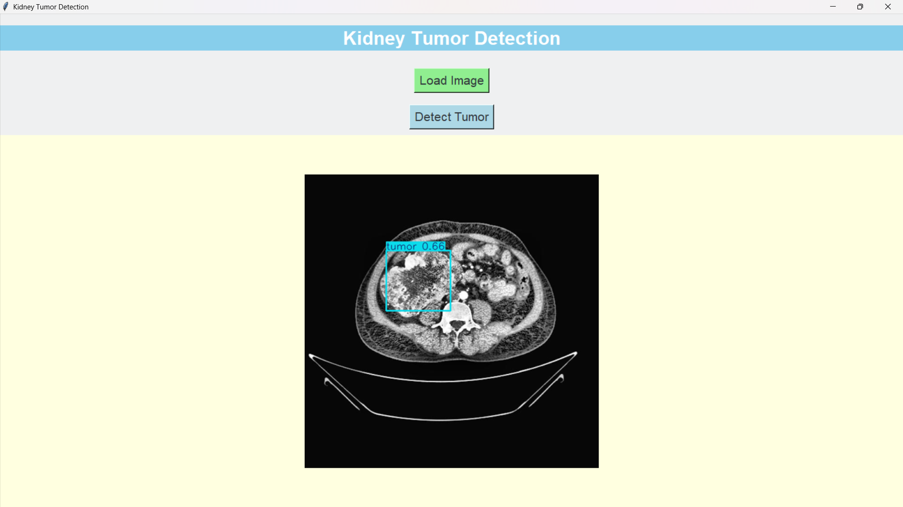
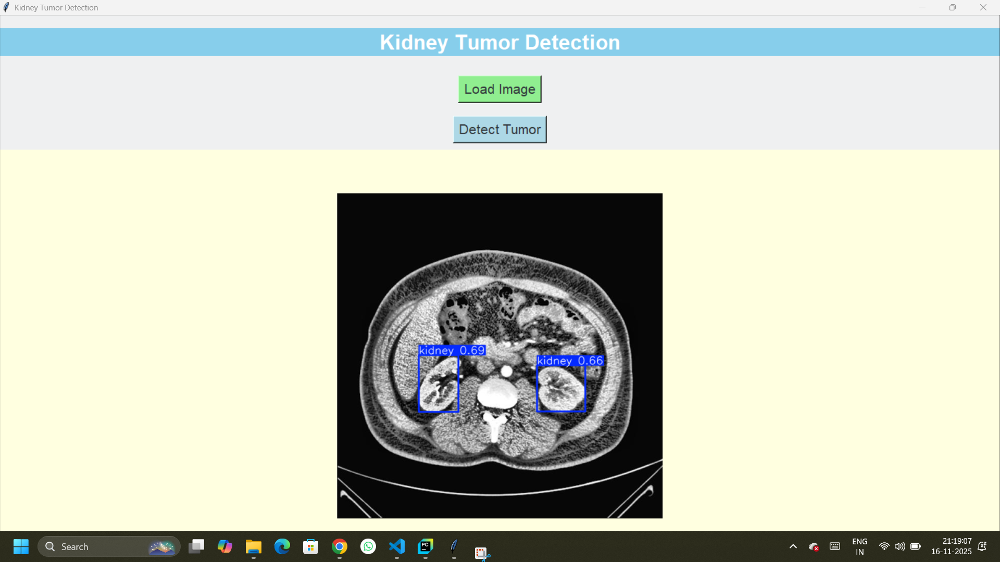

# Kideny_Tumor_Detection
This project presents an AI-based system for detecting kidney tumors using advanced image segmentation techniques. It leverages the YOLOv8 model, known for its high accuracy and efficiency in medical image segmentation, to identify and segment abnormal tumor regions in kidney scans.supporting early detection and improved clinical decision-making.

## 🎥 Working Demonstration

[![Watch the Working Video]](Working_Video.mp4)
*Click the image above to watch the system demonstration video*

**Video Description:** This video shows the complete workflow of our kidney tumor detection system, including image upload, AI processing, and real-time prediction results.

---

## 📸 Application Screenshots

### 1. Landing Page

**Main application interface showing the welcome screen and navigation options for tumor detection**
*Clean interface with light yellow central display area for messages and image workspace. Designed for simplicity to enable radiologists and gynecologists to easily use the system for kidney tumor detection and segmentation. Supports multiple image formats including JPG, PNG, and medical DCM files.*


### 2. Tumor Detection Result

**Positive case: System successfully identifies and segments kidney tumor with confidence score**
*AI-powered tumor detection showing segmented kidney tumor boundaries. When users click "Detect Tumor", deep learning algorithms scan the image, identify potential tumor regions, and perform precise segmentation. This automated approach reduces manual detection time while maintaining accuracy across various image qualities.*


### 3. Non-Tumor Detection Result

**Negative case: System confirms no tumors detected in the uploaded medical image**
*System analysis confirming no tumors detected. The application loads images from datasets or local repositories, displays them centrally for user validation, and provides graphical feedback before processing. Supports clinical workflow flexibility with versatile image source compatibility.*

---

## 🚀 Features
- AI-powered kidney tumor detection
- Real-time image segmentation
- User-friendly web interface
- Medical-grade accuracy

## 🛠️ Installation
```bash
pip install -r requirements.txt
python app.py
